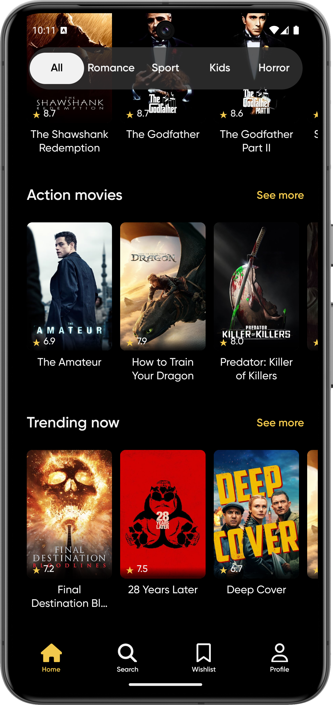

<p align="center">
  
</p>

# Digital Academy Bootcamp: Mobile Development

## React Native Movies App (TypeScript)

This is a modern React Native Movies App built with [Expo](https://expo.dev/) and TypeScript, designed to showcase best practices in mobile development. Powered by the [TMDb API](https://developer.themoviedb.org/reference/intro/getting-started), the app delivers up-to-date movie content, including trending, top-rated, upcoming, and now playing films.

Explore movies by genre, discover Marvel and action hits, and enjoy detailed information such as ratings, descriptions, and categories—all presented in a beautifully crafted interface inspired by this [Figma design](https://www.figma.com/community/file/1126286295256197533/movies-mobile-app-home-light-dark).

This open source project focuses on learning and applying modern React Native concepts, including custom hooks, advanced navigation, theming, animations, and type safety with TypeScript.

Developed as part of the **Digital Academy Bootcamp** at **AssureSoft**.

- Team Demo: https://drive.google.com/drive/folders/1CkY9LMx8NFhrpb9PdMTpGuhXET3kKdLk?usp=sharing
- App Demo: https://youtu.be/9X2jDw7je3Y

---

## 📑 Table of Contents

- [Key Concepts & Features](#-key-concepts--features)
- [Design](#-design)
- [Getting Started](#-getting-started)
- [Useful Expo Commands & Troubleshooting](#-useful-expo-commands--troubleshooting)
- [Screenshots](#-screenshots)
- [Credits & Acknowledgements](#-credits--acknowledgements)
- [License](#-license)

---

## 🏆 Key Concepts & Features

- **Custom Hooks** for reusable logic and cleaner components
- **API Consumption** using [The Movie Database (TMDb) API](https://developer.themoviedb.org/reference/intro/getting-started)
- **Navigation** with React Navigation (stack, bottom tabs)
- **Carousel & Animations** with react-native-reanimated and react-native-reanimated-carousel
- **Theming & UI** using react-native-paper and react-native-linear-gradient
- **Safe Area Handling** with react-native-safe-area-context
- **Custom Fonts** and splash screens
- **Vector Icons** with @react-native-vector-icons/fontawesome6
- **Environment Variables** with dotenv
- **Prettier** and **ESLint** for code formatting and linting
- **TypeScript** for type safety and better developer experience
- **Metro Config** customization for advanced bundling

---

## 🎨 Design

- Based on this [Figma community design](https://www.figma.com/community/file/1126286295256197533/movies-mobile-app-home-light-dark) for a modern movies mobile app (light & dark mode).

---

## 🚀 Getting Started

### 📱 Requirements

- Node.js (v18 or higher recommended)
- Expo CLI
- Android Studio (optional, for emulator)

### 1. Clone the repository

```bash
git clone https://github.com/nicopanozo/react-native-bootcamp.git
cd react-native-bootcamp
```

### 2. Install dependencies

```bash
npm install
npx expo install
```

> For additional packages, use:
>
> ```bash
> npx expo install <package-name>
> npm install <package-name>
> ```

### 3. Start the development server

```bash
npx expo start
```

Scan the QR code with the Expo Go app on your mobile device, or open it on an emulator.

### 4. Testing on Android Emulator

- Install Android Studio
- Create a virtual device (AVD)
- Run the emulator
- Start the app on the emulator:

```bash
npx expo start --android
```

---

## 🛠️ Useful Expo Commands & Troubleshooting

- **Clear Expo cache (recommended for fixing weird issues):**
  ```bash
  npx expo start -c
  ```
- **Reset Metro bundler cache:**
  ```bash
  npx react-native start --reset-cache
  ```
- **Clean node_modules and reinstall:**
  ```bash
  rm -rf node_modules
  npm install
  ```
- **Check for outdated dependencies:**
  ```bash
  npx expo install --check
  ```
- **Upgrade Expo SDK:**
  ```bash
  npx expo upgrade
  ```
- **Open project on web:**
  ```bash
  npx expo start --web
  ```
- **Open project on iOS simulator (macOS only):**
  ```bash
  npx expo start --ios
  ```
- **Show all available Expo commands:**
  ```bash
  npx expo --help
  ```

---

## 📸 Screenshots

|                          Home Screen                          |                          Movie Details                          |                          Genres                          |
| :-----------------------------------------------------------: | :-------------------------------------------------------------: | :------------------------------------------------------: |
|  |  |  |

---

## 📚 Credits & Acknowledgements

- Built with [React Native](https://reactnative.dev/) and [Expo](https://expo.dev/)
- Movie data powered by [The Movie Database (TMDb) API](https://developer.themoviedb.org/reference/intro/getting-started)
- UI inspired by [Figma Movies Mobile App Design](https://www.figma.com/community/file/1126286295256197533/movies-mobile-app-home-light-dark)
- Developed as part of the [Digital Academy](https://assuresoft.com/) Bootcamp at AssureSoft

---

## 📖 License

This project is open source and available under the [MIT License](LICENSE).
